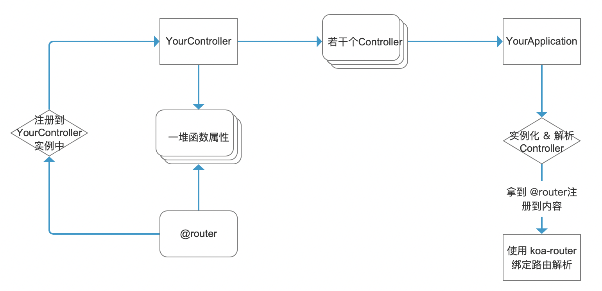

## 应用创建指南
应用本身基于**koa**，整合了**koa-router**和**co-body**并额外添加了[config](./config.md)能力


### 创建方法
```typescript
import {
  createApplication
} from 'sugar-server';

const myApplication = createApplication(
  [], // 中间件数组
  {}, // controller 集合
  {} // config 配置
);
```

#### 参数说明
1. 中间件数组，会被挂载到koa上，**先于controller**
2. controller集合，参考[controller](./controller.md)
3. config 配置，参考[config](./config.md)


### 修改onError
onError是自动捕获**controller**中的错误，并返回错误信息的钩子函数，你可以自定义它
```typescript
import {
  SugarServerError,
  ControllerContext
} from 'sugar-server';

myApplication.onError = function (e: SugarServerError, ctx: ControllerContext) {
  if (
    !ctx.res.writableEnded &&
    !ctx.res.writableFinished
  ) {
    ctx.body = {
      code: e.code || 0,
      message: e.message
    }
  }
}
```

### 应用设计思路
