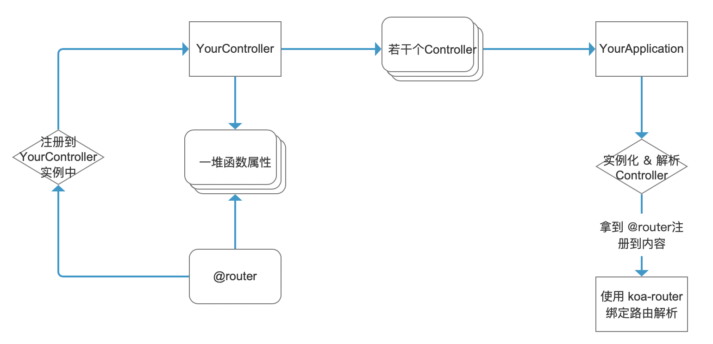

## 应用创建指南

应用本身基于 **koa**，整合了 **koa-router** 和 **co-body**，并额外添加了 [config](./config.md) 能力。  
可以简单理解为：在 Koa 之上，增加了一个带装饰器的 Controller 层和配置管理。

> 如果你是通过 `create-sugar-app` 创建的项目，一般会在 `server/index.ts` 或类似文件中看到一个已经写好的 `Application` 子类，你可以在这个文件基础上进行修改。

---

### 创建方法（最基础用法）

最基础的使用方式，是继承 `Application` 并通过静态字段挂载要使用的 `Controller`：
```typescript
import {
  Application
} from 'sugar-server';

class App extends Application {
  // 挂载的 Controller 列表，命中路由时会自动实例化对应 Controller
  static Controllers = []
}

const app = new App();
app.listen(9000);
```

#### 静态配置说明

`Application` 通过一组静态字段来控制自身行为：

1. **Controllers**: `typeof Controller[]`  
   挂载到当前应用上的 `Controller` 列表，参考 [Controller 配置指南](./controller.md)。
2. **Applications**: `typeof Application[]`  
   作为「子应用」挂载到当前应用上的其它 `Application` 列表，方便模块化拆分。
3. **defaultConfig**: `any`  
   应用的默认配置，会在构造函数中通过 [Config](./config.md) 扁平化后挂载到 `app.config` 上。
4. **host**: `string | { includes?: string[]; excludes?: string[] }`  
   当作为子应用被挂载时，用于限制当前 Application 仅在特定 `Host` 下生效。
5. **path**: `string | RegExp`  
   当作为子应用被挂载时，用于指定挂载路径前缀，例如 `/api`。
6. **rewrite**: `(reqUrl: url.UrlWithStringQuery, req: IncomingMessage) => string`  
   当作为子应用时，可自定义重写路由路径（`routerPath`），用于做简单网关、反向代理类能力。

---

### 子应用（Applications）使用示例

当项目变大时，你可以把不同业务模块拆成多个 `Application` 子类，通过 `Applications` 组合在一起：

```typescript
import {
  Application
} from 'sugar-server';

class ApiApp extends Application {
  static Controllers = [
    // 这里挂载 API 相关的 Controller
  ];
  static path = '/api'; // 只处理 /api 开头的路径
}

class AdminApp extends Application {
  static Controllers = [
    // 这里挂载后台管理相关的 Controller
  ];
  static path = '/admin';
}

class RootApp extends Application {
  static Applications = [
    ApiApp,
    AdminApp
  ];
}

const app = new RootApp();
app.listen(9000);
```

这样：

- 访问 `/api/...` 会进入 `ApiApp`
- 访问 `/admin/...` 会进入 `AdminApp`

你也可以结合 `host` / `rewrite` 做更复杂的网关行为。

---

### 修改 onError

`onError` 是自动捕获 **Controller** 中抛出的错误并返回错误信息的钩子函数。  
你可以覆盖它来统一处理业务错误，例如配合 `SugarServerError`：
```typescript
import {
  SugarServerError,
  Application,
  ControllerContext
} from 'sugar-server';


class App extends Application {
  onError = function (
    e: SugarServerError,
    ctx: ControllerContext
  ) {
    if (
      !ctx.res.writableEnded &&
      !ctx.res.writableFinished
    ) {
      if (typeof e.statusCode === 'number') {
        ctx.status = e.statusCode;
      }
      ctx.body = {
        code: e.code || 0,
        message: e.message
      }
    }
  }
}
```

> 注意：请确保在返回错误时提前判断响应是否已结束（如上例中的 `writableEnded` / `writableFinished` 判断），避免重复写入。

---

### 应用设计思路

整体设计可以理解为「Koa 应用 + 带装饰器能力的 Controller 层」的组合：Koa 负责 HTTP 生命周期，`Application` 负责路由挂载和 config 管理，`Controller` 负责具体的业务处理。  

